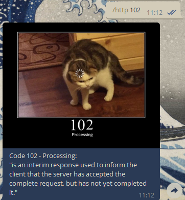

# Status Cat


## Sobre

---

Esse bot foi desenvolvido com o objetivo de ser utilizado para uma consulta rápida para desenvolvedores e outras pessoas que estudam/trabalham na área de tecnologia, com o para facilitar a vida e pesquisas, ou ao menos ser uma opção a mais para essas pessoas.

## Índice

<p align="center">
 <a href="#sobre">Sobre</a> •
 <a href="#índice">Índice</a> • 
 <a href="#features">Features</a> • 
 <a href="#instalação">Instalação</a> •  
 <a href="#autor">Autor</a> • 
 <a href="#licença">Licença</a>
 <a href="#créditos">Créditos</a>
</p>

## Features

---

O bot ainda está em desenvolvimento e ideas para features novas podem acontecer a qualquer momento, aqui está uma lista delas, que vai sendo marcada conforme forem sendo feitas.

-   [x] Exibir uma breve descrição de um código HTTP específico quando usado o comando com um argumento.
-   [ ] Quando o bot não conseguir uma imagem no [http.cat](https://http.cat/) fazer ele retornar ainda assim uma mensagem explicando o código HTTP.
-   [ ] Retornar um link ou pdf com a documentação da linguagem/framework pesquisado.

## Instalação

---

### Pré-requisitos

Antes de começar, você vai precisar ter instalado em sua máquina as seguintes ferramentas:
[Git](https://git-scm.com), [Node.js](https://nodejs.org/en/) e [Yarn](https://yarnpkg.com/).  
Além disto é bom ter um editor para trabalhar com o código como [VSCode](https://code.visualstudio.com/) ou o [Atom](https://atom.io/).  
Também será necessário que você já tenha criado o bot e adquirido o token da API do Telegram através do [BotFather](https://t.me/botfather).

### Executando o Bot

Clone este repositório

```bash
$ git clone <https://github.com/akiratorres/status-cat>
```

Acesse a pasta do projeto no terminal

```bash
$ cd status-cat
```

Vá para a pasta src

```bash
$ cd src
```

Instale as dependências

```bash
$ yarn install
```

Antes de executar o bot, crie o arquivo .env seguindo o .env.example e e garanta que as chaves necessárias estão corretamente preenchidas.

Execute a aplicação em modo de desenvolvimento

```bash
$ yarn dev
```

A partir daí a aplicação começará a ser executada no bot que você criou no Telegram.



## Autor

---

<a href="https://blog.rocketseat.com.br/author/thiago/">
 
 <br />
 <sub><b>Thiago Torres</b></sub></a>

Feito por motivos educacionais, para se aprimorar na linguagem e framework utilizados.

[](https://twitter.com/AkiraTorres_)
[](mailto:torres.thg@gmail.com)

## Licença

---

Este projeto esta sobe a licença [MIT](./LICENSE).

## Créditos

---

Um agradecimento especial para [http.cat](https://http.cat/), boa parte do projeto perderia o charme sem as imagens, e foi graças a esse site que eu tive inspiração para fazer o bot.
